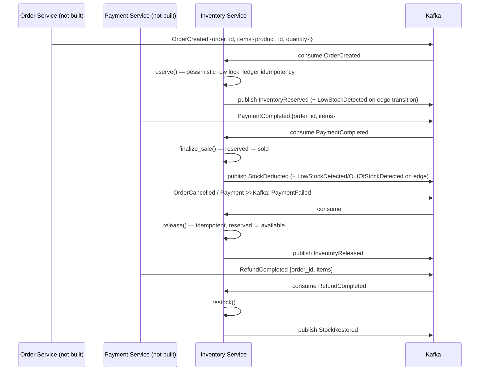

# Ecom Microservices

A FastAPI-based e-commerce platform, built as a `uv` workspace monorepo. Services are added phase by phase; each is independently deployable, owns its own Postgres database, and integrates with the others over Kafka events and a thin API gateway.

## Architecture

```
                              ┌──────────────┐
                little  ────► │ API Gateway  │  (JWT auth, RBAC, rate limit, /api/v1/*)
                     (8080)   └───────┬──────┘
                                      │ routes by prefix
        ┌───────────────┬────────────┼───────────────┐
        ▼                ▼            ▼               ▼
 ┌─────────────┐  ┌─────────────┐ ┌─────────────┐  (order/payment/...
 │ Auth Service │  │Product Svc  │ │Inventory Svc│    not built yet —
 │   (8001)     │  │  (8003)     │ │   (8004)    │    infra is pre-wired)
 └──────┬──────┘  └──────┬──────┘ └──────┬──────┘
        │  auth_db        │  product_db    │  inventory_db
        └────────────┬────┴────────┬───────┘
                      ▼             ▼
               ┌────────────┐ ┌──────────┐
               │  Postgres  │ │  Redis   │
               │ (per-svc   │ │ (cache,  │
               │  database) │ │  locks)  │
               └────────────┘ └──────────┘
                      ▲
                      │ events (Kafka, one topic per aggregate)
               ┌────────────┐
               │   Kafka    │
               └────────────┘
```

Shared code lives in `libs/ecom_common` (a `uv` workspace package): app assembly (`bootstrap.create_app`), JWT auth (`auth.py`), DB session/engine helpers (`db.py`), the Kafka event contract and client (`events.py`, `kafka.py`), Redis helpers (`redis.py`), pagination, error handling, health/readiness, logging, and a generic repository base. Every service reuses these instead of reimplementing them.

**Services today**: `auth_service` (8001), `product_service` (8003), `inventory_service` (8004), `api_gateway` (8080). Order Service, Payment Service, and the rest of the catalog (cart, wishlist, notification, search, review) are **not implemented yet** — their databases, gateway routes, and Kafka event types are already reserved in the infra (`deploy/postgres/init-databases.sh`, `api_gateway/route_table.py`, `ecom_common/events.py`) so they can be added without touching what exists.

## Event flow

Events are published as a JSON `EventEnvelope` (`event_id`, `event_type`, `occurred_at`, `producer`, `correlation_id`, `partition_key`, `payload`) to one Kafka topic per aggregate (`product.events`, `inventory.events`, `order.events`, `payment.events`, ...), partitioned by aggregate id to preserve per-entity ordering. A failed publish never fails the write path — it's logged and the request still succeeds; consumers are expected to reconcile via backfill (internal `GET` endpoints exist for exactly this).

Inventory Service is the first real Kafka **consumer** in this codebase (auth/product only publish). It reacts to Order/Payment events using the contracts already defined in `ecom_common.events.EventType`, even though Order Service and Payment Service don't exist yet:



`OrderConfirmed` is also consumed as a defensive fallback finalize trigger (covers COD-style flows where confirmation might precede payment capture) — it's a no-op if `PaymentCompleted` already finalized the sale, via the same ledger idempotency. Since no real Order/Payment producer exists yet, this contract is validated with hand-built event fixtures (see `services/inventory_service/tests/unit/test_consumers.py`), not a live end-to-end flow.

## Inventory lifecycle

Each product has one `inventory` row (single warehouse per product in v1) tracking `available_quantity` / `reserved_quantity` / `sold_quantity` against a `status` derived from `available_quantity` vs `reorder_threshold`:

```
IN_STOCK  ──(available <= reorder_threshold)──>  LOW_STOCK  ──(available == 0)──>  OUT_OF_STOCK
   ▲                                                                                     │
   └─────────────────────────── restock() / release() ────────────────────────────────┘
```

Status-transition events (`LowStockDetected`, `OutOfStockDetected`) are **edge-triggered** — published only when a mutation crosses into a worse state, not on every write while already there.

Each reserve/release/finalize is recorded in `inventory_reservations`, keyed uniquely by `(product_id, order_id)`. That's the **business-level idempotency** layer: a retried reservation for the same order is a no-op instead of a double-decrement. It's independent from (and complements) the Kafka consumer's own `event_id`-based dedup, which only guards against redelivery of the identical envelope.

Concurrency: quantity mutations (`reserve`/`release`/`finalize_sale`/`restock`/`adjust`) take a Postgres row lock (`SELECT ... FOR UPDATE`) inside a transaction — the simplest correct way to prevent overselling under concurrent requests for the same product. The low-contention metadata update (`PUT /inventory/{product_id}`, i.e. sku/warehouse/thresholds) instead uses optimistic locking via a `version` column, to avoid holding a row lock for edits that rarely conflict.

## Database schema

**`inventory`** — `id`, `product_id` (unique; no DB-level FK since product lives in a separate database), `sku` (unique), `warehouse_location`, `available_quantity` / `reserved_quantity` (both `CHECK >= 0`), `sold_quantity`, `safety_stock`, `reorder_threshold`, `status`, `version`, `created_at`/`updated_at`.

**`inventory_reservations`** — `id`, `product_id`, `order_id`, `quantity`, `status` (`RESERVED`/`RELEASED`/`DEDUCTED`), `UNIQUE(product_id, order_id)`, `created_at`/`updated_at`.

Every other service follows the same per-service-database pattern: `auth_db`/`product_db`/`inventory_db`, each with its own role, provisioned by `deploy/postgres/init-databases.sh`. Migrations are managed with Alembic, one baseline + incremental revisions per service (`services/<name>/alembic/versions/`).

## API documentation

Each service serves its own interactive Swagger UI and machine-readable spec — there's no unified doc portal, since services are independently deployable and the gateway is a dynamic proxy, not a documented API surface itself:

| Service | Swagger UI | OpenAPI spec |
|---|---|---|
| Auth Service | http://localhost:8001/docs | http://localhost:8001/openapi.json |
| Product Service | http://localhost:8003/docs | http://localhost:8003/openapi.json |
| Inventory Service | http://localhost:8004/docs | http://localhost:8004/openapi.json |
| API Gateway | http://localhost:8080/docs | mostly empty by design — its one route is a dynamic proxy excluded from the schema; browse the backend services above instead |

All protected endpoints show a padlock and the Swagger "Authorize" button accepts a bearer token (sign in via `POST /auth/signin`, paste the returned `access_token`). `internal/*` routes are intentionally excluded from every service's schema — they're service-to-service only and the gateway 404s any request to `/api/v1/internal/*`.

## Postman collection

Import both files from `docs/postman/`:
- `ecom_microservices.postman_collection.json` — every documented endpoint across Auth/Product/Inventory, organized in folders per service, plus a few gateway-routed examples.
- `ecom_microservices.postman_environment.json` — `base_url` (gateway), `auth_base_url`/`product_base_url`/`inventory_base_url` (direct per-service URLs), `jwt_token`, `user_id`, `product_id`, `inventory_id`, `order_id`.

Select the environment, then run **Auth Service → Sign In** first — its embedded test script auto-saves the returned `access_token` into `{{jwt_token}}`, which every other authenticated request reuses automatically. `order_id` is a placeholder value since Order Service doesn't exist yet.

## Local development

```bash
uv sync --all-packages          # install the whole workspace

make infra-up                   # postgres + redis only, for running services on the host (add `make up` below for Kafka)
# per service, in separate terminals:
cd services/auth_service      && uv run alembic upgrade head && uv run uvicorn auth_service.main:app --port 8001 --reload
cd services/product_service   && uv run alembic upgrade head && uv run uvicorn product_service.main:app --port 8003 --reload
cd services/inventory_service && uv run alembic upgrade head && uv run uvicorn inventory_service.main:app --port 8004 --reload

# or, the full containerized stack:
make up                         # docker compose up -d --build (all services + kafka + postgres + redis)
make down

make test                       # fast unit tests, no containers (libs + all services)
make test-inventory-cov         # coverage report scoped to inventory_service (currently ~93%)
make lint                       # ruff over the whole workspace
```

Each service also has a `make migrate-<service>` shortcut (`migrate-auth`, `migrate-product`, `migrate-inventory`) for running its Alembic migrations against local infra without `cd`-ing in.

### Configuration & secrets

**No secret or environment-specific value is hardcoded in source.** Every service loads typed, validated config from environment variables via a shared base class (`ecom_common.settings.BaseServiceSettings`, built on Pydantic Settings) that every service's own `Settings` subclasses — this is the single centralized configuration mechanism for the whole platform, not reimplemented per service. It:

- Loads from environment variables (highest precedence) and falls back to a `.env` file if present.
- Requires `JWT_SECRET` with **no default** — every service fails fast at boot if it's missing, rather than silently signing tokens with a hardcoded fallback.
- Provides sensible, non-sensitive defaults for everything else (log level, cache TTLs, rate limits, timeouts, ...), all still overridable per environment.

**Which `.env` file loads** is itself selectable via `ENV_FILE` (defaults to `.env`), so an environment-specific file can be pointed at without code changes:

```bash
ENV_FILE=.env.staging uv run uvicorn auth_service.main:app
```

**Environment files** (`.env.example`/`.env.development`/`.env.staging`/`.env.production`/`.env.test`, at repo root for the docker-compose/platform-level vars — Postgres superuser + per-service DB passwords, `JWT_SECRET`, `ENV`, `LOG_LEVEL` — and per-service under `services/<name>/.env.example` for that service's full settings, DB URL, cache TTLs, OAuth credentials, etc.) are all committed as safe templates with placeholder or dev-only values. `.env.production` is a template only — real production secrets are never meant to live in a file at all; they're injected by whatever's actually deploying the service (Docker/Kubernetes secrets, a CI/CD pipeline, or a cloud secret manager). Actual working `.env` files (copied from the `.example` templates and filled in) are gitignored (`.env`, `services/*/.env`) and must never be committed.

To get a local dev environment running:
```bash
cp .env.example .env                                    # docker-compose-level vars
cp services/auth_service/.env.example services/auth_service/.env
cp services/product_service/.env.example services/product_service/.env
cp services/inventory_service/.env.example services/inventory_service/.env
```
The `.env.example` defaults already work out of the box for local dev without editing anything.

A missing/empty `KAFKA_BOOTSTRAP_SERVERS` disables event publishing/consuming for that service without blocking startup — useful for local dev without a broker running. Known secret-shaped log keys (`password`, `secret`, `*_token`, `client_secret`, `api_key`, ...) are redacted by the shared structlog config (`ecom_common.logging.configure_logging`) before any line is emitted, and error responses (`ecom_common.errors`) only ever surface developer-authored messages, never raw exception internals — so a misconfigured downstream call can't leak a connection string or token into a client-facing response.

### Testing conventions

Unit tests use `pytest` + `pytest-asyncio` (auto mode), `httpx` for API-level tests via `ASGITransport`, `fakeredis` for Redis, and an in-memory/temp-file SQLite database for the ORM layer (mirroring the pattern in `services/auth_service/tests/unit/test_token_rotation.py`). No test in `make test` requires Docker; tests marked `integration` (testcontainers) or `e2e` (full compose stack) are excluded by default and run separately via `make test-integration`.
