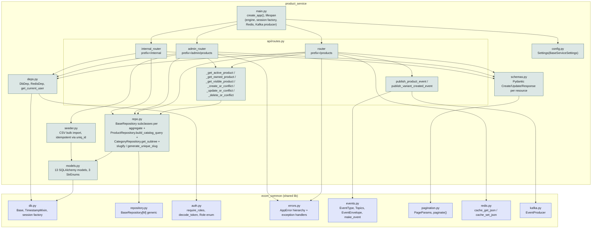

# Diagram: Component Diagram — Product Service Internals

## Diagram Type
Component Diagram

## Subject
The internal module structure of `services/product_service/src/product_service/` and how a
request moves through its layers.

## Audience
Engineers making changes inside this service.

## Required Elements
Every source module, the three routers, the shared `ecom_common` library boundary, and the
direction of dependency between layers.

## Diagram

## Notes

- Layering is strict: `api/routes.py` → `repo.py` → `models.py`, with `schemas.py` used only at
  the API boundary (request/response DTOs never leak into `repo.py`). No layer is skipped —
  routes never issue raw SQL against `models.py` outside of the handful of ad-hoc `select()`
  calls in list endpoints, which still go through the same SQLAlchemy session (`DbDep`), not a
  separate access path.
- `_get_active_product` / `_get_owned_product` / `_get_visible_product` in `api/routes.py` are the
  three-tier fetch-and-authorize helper chain: `_get_active_product` is the base (excludes
  soft-deleted), `_get_owned_product` layers ownership on top of it (write paths), and
  `_get_visible_product` layers publication status on top of it (public read paths). Every
  product-scoped endpoint uses exactly one of these three — see the LLD's Edge Cases table for
  which endpoints use which.
