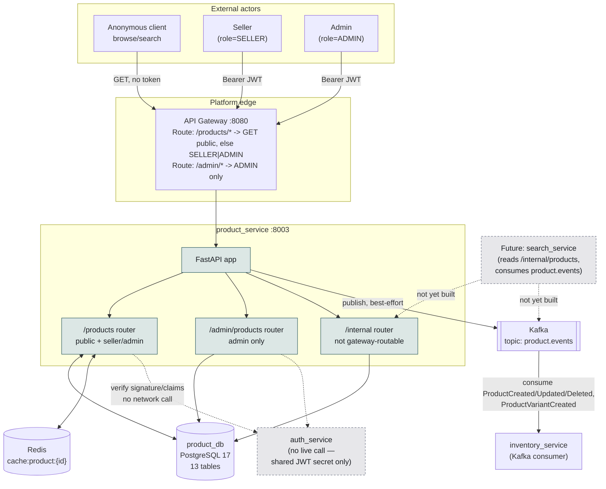

# Diagram: System Context — Product Service

## Diagram Type
Context Diagram (C4 Level 1 equivalent)

## Subject
`product_service`'s place in the `ecom_microservices` platform — who calls it, what it calls,
and where the trust/RBAC boundaries sit.

## Audience
Engineers onboarding to this service; reviewers evaluating a cross-service change.

## Required Elements
Anonymous client, authenticated Seller/Admin, API Gateway, `product_service`, its database,
Redis, Kafka, the one real downstream consumer (`inventory_service`), and the (currently
network-decoupled) relationship to `auth_service`.

## Diagram

## Notes

- RBAC is enforced **twice**, deliberately: coarsely at the gateway (route-prefix policy, so a
  completely unauthenticated request never even reaches the service for a mutating call) and
  precisely inside `product_service` (`require_seller`/`require_admin` plus per-resource
  ownership checks) — the service does not trust the gateway's check alone, since `/internal/*`
  and direct-to-8003 access exist outside the gateway's policy entirely.
- `auth_service` is drawn dashed/external because there is no runtime network dependency — JWT
  verification is local, against a shared secret/issuer/audience. This is a trust relationship,
  not a service call.
- The Kafka edge is one-directional today: `product_service` only **publishes**; it consumes
  nothing (contrast with `inventory_service`, which both consumes Order/Payment/Refund events and
  publishes its own).
