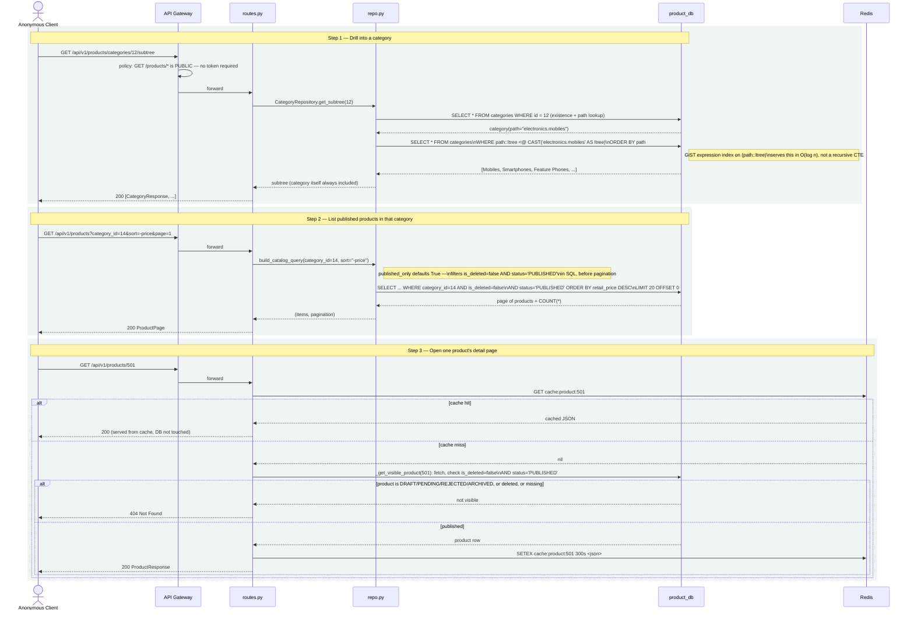

# Diagram: E2E Flow — Public Catalog Browse & Category Drill-Down

## Diagram Type
Sequence Diagram (end-to-end)

## Subject
An anonymous shopper browsing a category, then viewing one product — covering the cache-first
read path and the publication-status enforcement.

## Audience
Frontend engineers integrating against this API; engineers validating cache invalidation
correctness.

## Required Elements
Anonymous client, API Gateway (public policy), Redis cache hit/miss branch, Postgres, the
category subtree query.

## Diagram

## Notes

- This is the flow the HLD's "read-heavy, cache-first" scalability claim rests on: step 3's cache
  hit path never touches Postgres at all. Cache invalidation happens on the write side
  (`update_product`/`delete_product` call `redis.delete(f"cache:product:{id}")` before returning),
  not on a TTL alone.
- Step 2 deliberately does **not** cache — only single-product reads are cached today
  (`product_cache_ttl_seconds` applies to `get_product` only). List/filter results recompute every
  request; see the LLD's Performance Considerations for why this is an accepted gap at current
  scale rather than an oversight.
- Every branch in step 3 that returns a product also implicitly proves the product is
  `PUBLISHED` and not soft-deleted — there is no code path in this flow where a client can
  distinguish "doesn't exist" from "exists but not published yet," which is the intended
  behavior for a public endpoint (see the LLD's Edge Cases §1–2).
