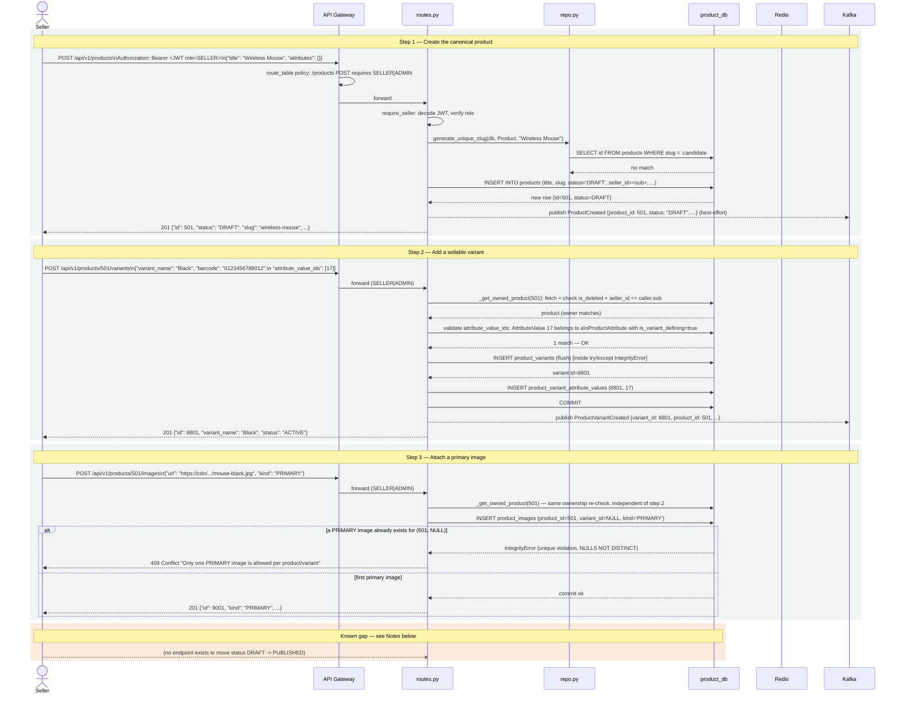

# Diagram: E2E Flow — Seller Lists a New Product

## Diagram Type
Sequence Diagram (end-to-end, client through persistence and eventing)

## Subject
The full path of a seller creating a catalog product, then adding a variant and a primary
image to it — spanning the API Gateway, RBAC/ownership enforcement, Postgres, Redis, and Kafka.

## Audience
Engineers implementing a client against this API; reviewers validating the auth/ownership model.

## Required Elements
Seller actor, API Gateway (with its policy check), FastAPI handlers, the ownership-check helper
chain, Postgres, and the best-effort Kafka publish.

## Diagram

## Notes

- **Every step re-derives ownership independently** (`_get_owned_product` is called fresh in each
  handler) — there is no session/request-scoped cache of "is this caller the owner," which is
  correct but means the same `SELECT` + role check runs 3 times across this flow. Acceptable at
  current traffic; would be a candidate for a single request-scoped fetch if this flow's latency
  ever matters.
- **Critical gap surfaced by this diagram:** `ProductCreate`/`ProductUpdate` (`schemas.py`) have
  no `status` field, and no endpoint in `api/routes.py` transitions a product's `status` at all.
  Combined with the Phase 1 fix that makes `GET /products`/`GET /products/{id}` only return
  `status == PUBLISHED` rows, **every product created through this flow is permanently invisible
  to public browsing** — there is currently no legitimate way to reach `PUBLISHED` from the API.
  This is flagged prominently in the LLD's Open Questions and `docs/FutureWork.md`; it is not
  fixed by this documentation pass. See the end-of-task summary for the explicit call-out.
