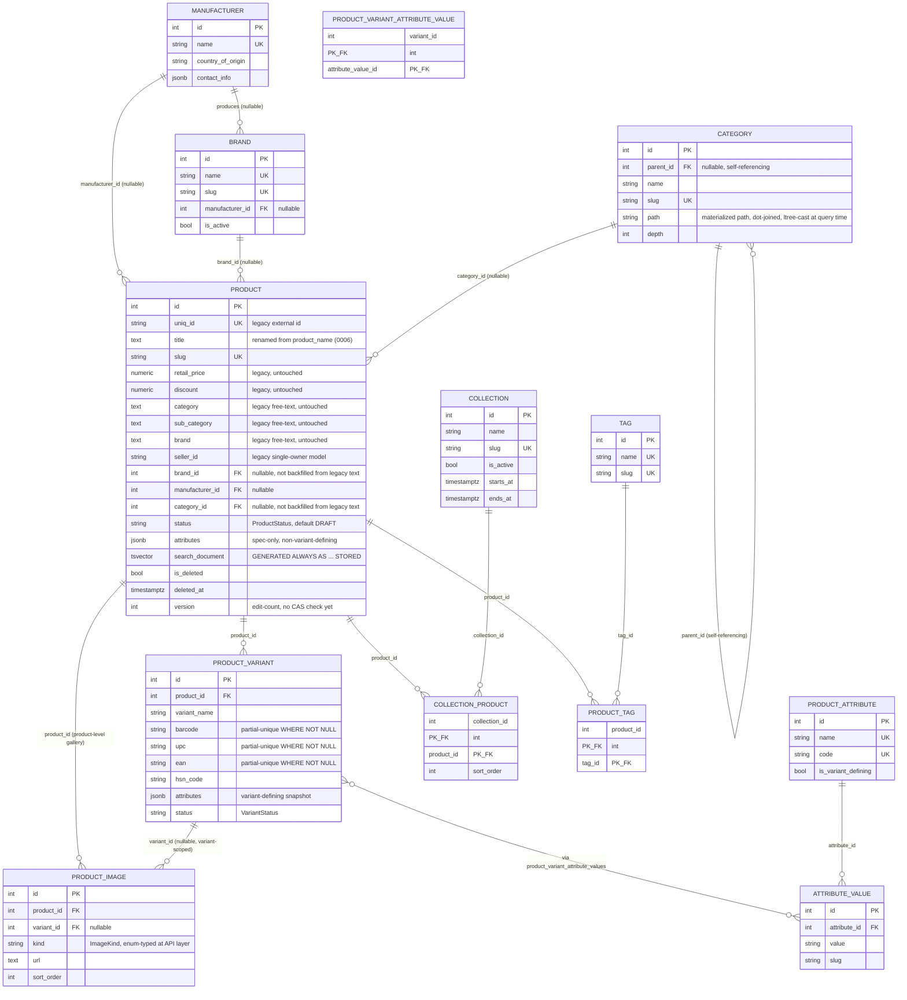

# Diagram: Entity-Relationship Diagram — product_db

## Diagram Type
ER Diagram

## Subject
The full `product_db` schema as of migration `0006` — 13 tables spanning the product catalog,
taxonomy, variant, and image concerns.

## Audience
Engineers writing queries/migrations against this schema; reviewers of schema changes.

## Required Elements
Every table, every FK relationship, and the columns most relevant to how each table is actually
queried (per `repo.py`).

## Diagram

## Notes

- **No table in this diagram has a foreign key into another service's database.** Everything
  above is `product_db`-internal. The one cross-service reference this service participates in
  (`inventory_service.inventory.product_id` → this `PRODUCT.id`) is deliberately absent from this
  diagram because it isn't a real foreign key — see `docs/DecisionLog.md`'s note on the
  per-service-database pattern, and `e2e-product-inventory-sync.md` for how that reference is
  actually kept consistent (via events, not a constraint).
- `CATEGORY.path` looks like a plain string here because it is one at the SQLAlchemy/column-type
  level — the `ltree` extension is used only via a GiST *expression* index and raw-SQL casts in
  `CategoryRepository.get_subtree`, never as the column's declared type. See the LLD §4 and
  `docs/DecisionLog.md` for the full reasoning (avoiding asyncpg custom-type-codec fragility).
- `PRODUCT.brand`/`category`/`sub_category`/`retail_price`/`discount`/`seller_id` (marked
  "legacy" above) coexist with the normalized `brand_id`/`category_id`/`manufacturer_id` FKs by
  design — Phase 1 is additive, not a replacement migration. They are not shown with a
  relationship line because they are plain unindexed-beyond-legacy text/numeric columns, not
  foreign keys.
