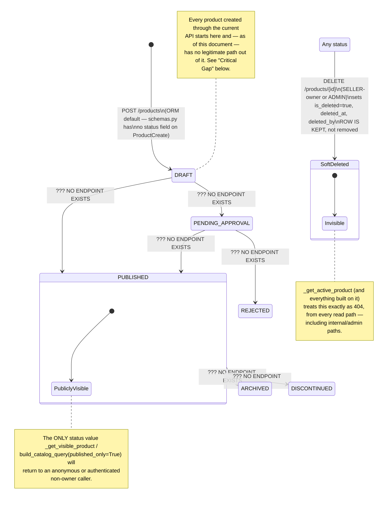

# Diagram: E2E Flow — Product Lifecycle State Machine

## Diagram Type
State Diagram

## Subject
Every state `Product.status` can hold, which ones are actually reachable through the current
API, and how soft-delete (`is_deleted`) composes with `status`.

## Audience
Engineers building a moderation/publish workflow; engineers debugging "why is this product not
showing up."

## Required Elements
All six `ProductStatus` values, the soft-delete flag as an orthogonal axis, and — critically —
an honest marking of which transitions have no implementing endpoint today.

## Diagram

## Notes

### Critical gap (surfaced by writing this diagram, not previously called out)

`python/services/product_service/src/product_service/schemas.py`'s `ProductCreate` and `ProductUpdate`
have no `status` field, and no handler in `api/routes.py` mutates `Product.status` after creation.
Combined with the Phase 1 visibility fix (`build_catalog_query`'s `published_only=True` default
and `_get_visible_product`'s explicit `status == PUBLISHED` check — both introduced to close a
real security gap where DRAFT/PENDING/REJECTED products were publicly visible), the net effect is:

> **Every product created via `POST /products` today defaults to `DRAFT` and has no way to ever
> become `PUBLISHED`.** The public catalog (`GET /products`, `GET /products/{id}`, category/
> collection product listings) will never show a product created after this redesign shipped,
> until a status-transition mechanism is added.

This was not introduced by this documentation task — the missing transition endpoint predates it
— but the *consequence* (permanent invisibility, rather than the pre-fix behavior of "everything
is visible regardless of status") is a direct result of the security fix. It is real and worth
prioritizing; see `docs/FutureWork.md` for where this should be tracked, and the top-level task
summary for the explicit call-out.

### What does work today

- `DRAFT → SoftDeleted`, `PUBLISHED → SoftDeleted`, and every other `status → SoftDeleted`
  transition work correctly and are covered by the test suite
  (`python/services/product_service/tests/integration/test_soft_delete.py`).
- `status='PUBLISHED'` is set at the **database level** as the `server_default` for the migration
  `0006` backfill — meaning every product that existed *before* this redesign (the ~3271-row
  seeded catalog) was retroactively marked `PUBLISHED` and remains correctly visible. The gap
  above only affects products created **after** the redesign, through the API.
