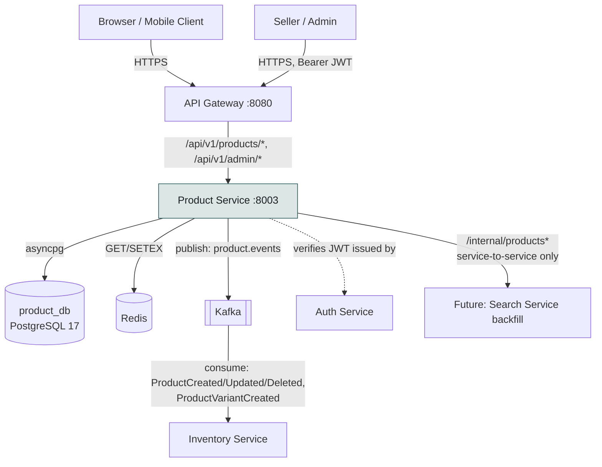

# High Level Design: Product Service

Last verified against commit: working tree as of the Phase 1 Catalog Core redesign
(product_service migrations `0001`–`0006`; see `docs/features/product-catalog-core-phase1.md`
for the redesign's own history), plus the Full Catalog Seed Generator
(`docs/features/catalog-full-seed-generator.md`) — no schema change, adds the
`catalog_seeder.py`/`_seed_utils.py`/`scripts/generate_seed_data.py` seeding layer and the
`POST /admin/catalog/seed` endpoint referenced in §4 and §6 below.

## 1. Overview

`product_service` is the catalog bounded context of the `ecom_microservices` platform. It
owns the sellable product catalog end to end: canonical product content (title, description,
SEO metadata), the taxonomy that classifies it (brands, manufacturers, categories, tags,
collections), the sellable configurations of a product (variants, with universal identifiers
like barcode/UPC/EAN/HSN), and the media attached to it (images). It is a stateless FastAPI
application backed by its own PostgreSQL database (`product_db`), fronted by the API Gateway,
and integrated with the rest of the platform exclusively through Kafka domain events — it has
no synchronous dependency on any other service at request time.

It does **not** own inventory/stock (that's `inventory_service`), pricing history or
multi-seller offers (deferred to a later phase — see Open Questions), or identity (that's
`auth_service`; `product_service` only verifies JWTs issued elsewhere).

## 2. Goals & Non-Goals

- **Goals:**
  - Be the single source of truth for catalog content, browsable by anonymous users and
    manageable by authenticated sellers/admins.
  - Support a normalized product taxonomy (categories as a real hierarchy, brands/manufacturers
    as real entities) instead of free-text fields.
  - Support products with multiple sellable variants (size/color/etc.), each with its own
    physical/compliance identifiers.
  - Publish every catalog change as a Kafka event so other services (today: `inventory_service`;
    future: a search/indexing service) can react without polling this service.
  - Stay a plain CRUD-and-query service — no orchestration of other services' state.
- **Non-Goals (this phase):**
  - Per-seller pricing/offers on a shared catalog item (a "SellerListing" concept) — today a
    product still has a single `seller_id` owner, carried over from the pre-redesign model.
  - Owning stock/reservation state — that is `inventory_service`'s job; this service only
    emits identifiers `inventory_service` can key off of.
  - Search indexing itself — `product_service` exposes the data (`search_document` tsvector,
    an internal bulk-dump endpoint) a future search service would consume; it does not index.

## 3. Context Diagram

`product_service` never calls `auth_service` over the network — JWTs are verified locally
using a shared secret/issuer/audience (`ecom_common.auth`), the same pattern every service in
this platform uses. The only inbound traffic is via the API Gateway (public + seller/admin
routes) or direct service-to-service calls to the `/internal/*` router (not gateway-routable).

## 4. Major Components

| Component | Responsibility | Owner Layer |
|---|---|---|
| `api/routes.py` | HTTP surface: 3 routers (`/products` public+seller, `/admin/products` admin-only, `/internal` service-to-service), request validation, RBAC/ownership enforcement, cache read-through, event publication | Backend (API) |
| `repo.py` | `BaseRepository`-derived data-access classes per aggregate, the catalog query builder (`ProductRepository.build_catalog_query`), category subtree traversal, slug generation | Backend (Data Access) |
| `models.py` | SQLAlchemy 2.0 ORM models — 13 tables across catalog/taxonomy/variant/image concerns | Backend (Domain Model) |
| `schemas.py` | Pydantic v2 Create/Update/Response DTOs per resource, strict enum typing on lifecycle/status fields | Backend (API Contract) |
| `seeder.py` | One-time CSV bulk-import of the legacy demo catalog (~3271 rows), idempotent via a content-derived `uniq_id` | Backend (Bootstrap) |
| `catalog_seeder.py` | Config-driven loader for the full 13-table catalog fixture (`scripts/generate_seed_data.py`'s output); `seed_full_catalog` orchestrates FK-ordered, idempotent (`ON CONFLICT DO NOTHING`) loads with a last-table fast-path skip and per-table sequence resync | Backend (Bootstrap) |
| `_seed_utils.py` | Batch-insert/fallback/gzip-read/sequence-resync helpers shared by `seeder.py` and `catalog_seeder.py` | Backend (Bootstrap) |
| `scripts/generate_seed_data.py` | Standalone, deterministic (seeded RNG) offline generator for the 13-table fixture consumed by `catalog_seeder.py`; not part of the app's runtime import path, run manually to regenerate `seed/catalog/*.json.gz` | Backend (Dev Tooling) |
| `deps.py` | FastAPI dependency wiring: DB session, Redis client, current-user extraction | Backend (Infra Glue) |
| `config.py` | Typed settings (`Settings(BaseServiceSettings)`) — DB URL, cache TTL, seed path | Backend (Config) |
| `main.py` | App assembly via `ecom_common.bootstrap.create_app`, lifespan (engine/session factory/Redis/Kafka producer startup), readiness probes | Backend (Bootstrap) |
| Alembic (`alembic/versions/`) | Six sequential, hand-written migrations (`0001`–`0006`) — no autogenerate | Backend (Schema Evolution) |
| `ecom_common` (shared lib) | `Base`/`TimestampMixin`, generic `BaseRepository`, pagination, JWT verification, error taxonomy, Kafka `EventProducer`/`EventEnvelope`, Redis cache helpers | Shared/Infra |

## 5. Data Flow (Narrative)

**Public read path:** a client hits the API Gateway, which forwards `GET` requests under
`/products/*` without requiring a token (`policies={"GET": PUBLIC}` in the gateway's route
table). `get_product` first checks Redis (`cache:product:{id}`); on a miss it queries Postgres
through `_get_visible_product`, which enforces both `is_deleted == False` and
`status == PUBLISHED` — a draft, pending, rejected, or archived product is invisible to this
path, full stop. The result is cached with a TTL (`product_cache_ttl_seconds`, default 300s)
before being returned.

**Seller/admin write path:** mutations require a Bearer JWT; the gateway enforces
SELLER-or-ADMIN for non-GET `/products/*` calls and ADMIN-only for all of `/admin/*`, and
`product_service` re-derives the same role from the token locally (`require_seller`,
`require_admin`) plus an ownership check (`product.seller_id` must match the caller, unless
they're an admin) for anything scoped to a specific product. A successful write commits to
Postgres, invalidates the relevant Redis key, and — only after the commit succeeds — publishes
a best-effort Kafka event to `product.events`.

**Cross-service propagation:** `inventory_service` is today's only real consumer of
`product.events` (`ProductCreated`, `ProductUpdated`, `ProductDeleted`, and the new
`ProductVariantCreated`). Event delivery is best-effort — a broker outage never fails a catalog
write; the `/internal/products` bulk-dump endpoint exists specifically so a consumer that missed
events can reconcile by re-pulling full state.

## 6. External Dependencies

| Dependency | Nature | Failure mode if unavailable |
|---|---|---|
| PostgreSQL (`product_db`) | Synchronous, required | Every request fails; `/health/ready` reports `database: false` |
| Redis | Synchronous, required for cache read-through, but reads/writes degrade gracefully — see note below | `/health/ready` reports `redis: false`; individual requests still function without caching if the client happens to catch the exception (not currently wrapped defensively — see Open Questions) |
| Kafka | Asynchronous, best-effort | Event publish failures are logged and swallowed (`except Exception: log.exception(...)`); no write ever fails because of Kafka |
| `auth_service` | Indirect (shared JWT secret/issuer/audience only) | No live dependency — a signature/claims check against a shared secret, not a network call |
| API Gateway | Inbound only | N/A — the gateway is a caller, not a dependency of this service |

## 7. Consistency & Availability Tradeoffs

`product_service` chooses **availability over strong cross-service consistency** at every
boundary that isn't its own database transaction:

- Within its own database, writes are strongly consistent (standard Postgres ACID transactions;
  `_create_or_conflict`/`_update_or_conflict`/`_delete_or_conflict` wrap every mutation).
- Across services, consistency is eventual and best-effort: a `ProductCreated` event might never
  arrive at `inventory_service` (broker down, consumer down), and there is currently no outbox
  table or retry queue — the mitigation is the `/internal/products` reconciliation endpoint, not
  guaranteed delivery.
- The per-service-database pattern (no cross-database foreign keys — see
  `docs/DecisionLog.md`) is itself a consistency/availability tradeoff: referential integrity
  between `product_service` and `inventory_service` (e.g. "does this `product_id` still exist")
  is enforced at the application layer, not the database layer, trading a guarantee for
  independent deployability and independent scaling of the two services' databases.

## 8. Scalability Plan

- **Stateless application tier:** the FastAPI process holds no in-memory session state; horizontal
  scaling is a matter of running more replicas behind the gateway.
- **Read-heavy workload, cache-first:** single-product reads are Redis-cached; category/brand/tag
  master-data lists are small and cheap to recompute per request today (no caching yet — flagged
  in Open Questions as the tables grow).
- **Query-shape-driven indexing:** every non-trivial index in the schema (partial indexes on
  `status`/`is_deleted`, GIN on JSONB `attributes` and the generated `search_document` tsvector,
  a GiST expression index for category subtree lookups) exists because a real query pattern in
  `repo.py` needs it — see the LLD's Performance Considerations section for the full mapping.
- **Not yet addressed:** table partitioning and read replicas are unnecessary at current scale;
  revisit if/when the catalog approaches the "millions of products" range discussed at the
  Phase 1 approval gate (see `docs/DecisionLog.md` for what carried forward from that proposal
  into this phase).

## 9. Security Model (Summary)

- **AuthN:** Bearer JWT, verified locally via `ecom_common.auth.build_get_current_user` against
  `jwt_secret`/`jwt_algorithm`/`jwt_issuer`/`jwt_audience` from settings; a Redis-backed `jti`
  denylist supports token revocation.
- **AuthZ:** role-based (`CUSTOMER`/`SELLER`/`ADMIN`/`SUPPORT`), enforced twice — once coarsely
  at the API Gateway (route-prefix policy) and once precisely in-service
  (`require_seller`/`require_admin` plus per-resource ownership checks). ADMIN is always
  implicitly allowed by `require_roles`.
- **Ownership model:** every product-scoped write (product itself, its variants, its images)
  checks `product.seller_id in (None, caller.sub)` — a seller can only mutate their own listings;
  admins bypass this.
- **Data exposure boundary:** `_get_visible_product` is the single choke point that keeps
  DRAFT/PENDING/REJECTED/ARCHIVED products invisible to anonymous/public reads; see the LLD for
  the full call-site inventory that was audited for this.
- See `docs/services/product-service/diagrams/e2e-seller-listing-flow.md` for the concrete
  authenticated write flow and `context-diagram.md`'s notes on the gateway/service RBAC split.

## 10. Observability

- Structured logging via `ecom_common.logging.get_logger`, contextual `correlation_id`
  propagation (see `EventEnvelope.correlation_id`, sourced from `structlog` contextvars).
- `/health/live` and `/health/ready` (the latter checking both the DB connection and Redis
  `PING`), wired via `ecom_common.bootstrap.create_app`.
- No metrics/tracing instrumentation specific to this redesign; `otel_enabled`/
  `otel_exporter_endpoint` exist in shared settings but are off by default across the platform.

## 11. Open Questions

- Redis read-through in `get_product` is not wrapped in a try/except — a Redis outage that isn't
  caught by `/health/ready` first could turn into per-request 500s rather than a graceful
  cache-bypass. Worth hardening if Redis availability becomes a real operational concern.
- Master-data list endpoints (`/products/brands`, `/products/tags`, etc.) are unpaginated public
  GETs — acceptable at today's scale (admin-curated, low-cardinality tables), flagged as a
  revisit trigger if any of them become high-cardinality or user-writable.
- The single-seller-per-product model (`Product.seller_id`) is the biggest remaining structural
  gap versus a real multi-seller marketplace; see `docs/FutureWork.md` for the deferred
  SellerListing/Pricing split (Phase 2) that would resolve it.
- **Startup catalog seeding blocks app reachability on a cold DB.** When
  `AUTO_SEED_ON_STARTUP=true` (the `docker-compose.yml` dev default), `main.py`'s
  lifespan `await`s the full 13-table seed before `yield` — the process doesn't start
  serving HTTP at all until seeding finishes (~6s+ empirically against a real Postgres
  connection, likely more in production). This is a deliberate, explicitly-flagged
  tradeoff (never serve traffic against a known-empty catalog), currently latent since
  nothing in this compose stack depends on `product-service`'s health today. See
  `docs/DecisionLog.md` ("Seed inline in the lifespan before `yield`") and
  `docs/FutureWork.md` for the prioritized follow-up.
