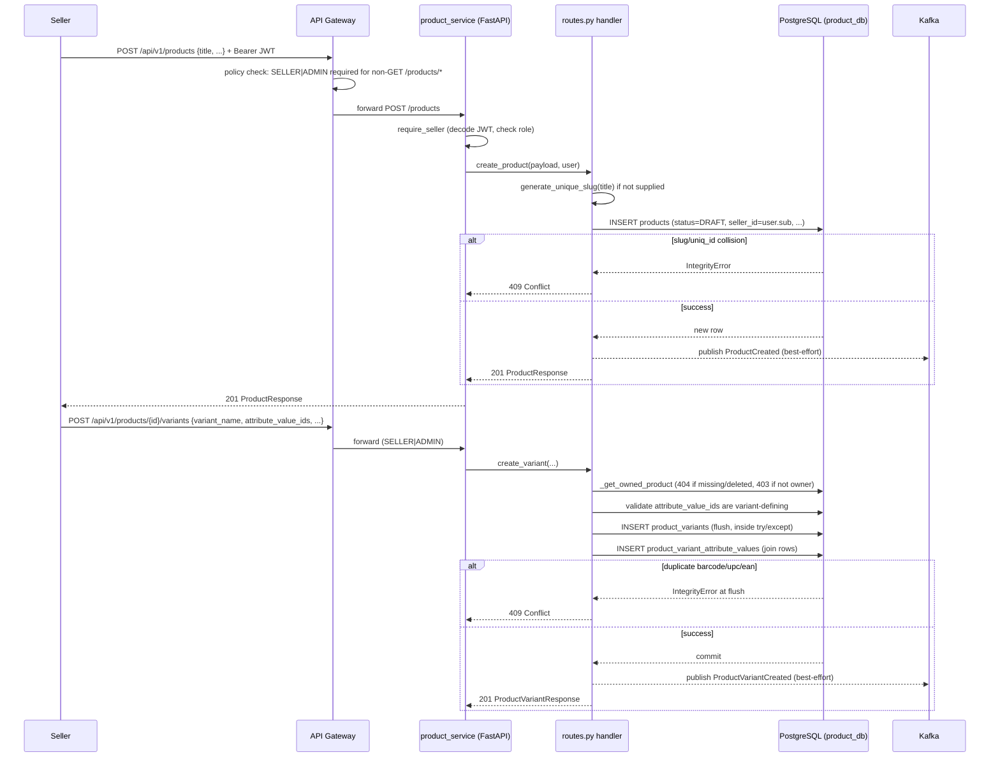

# Low Level Design: Product Service

Companion to `docs/services/product-service/hld/HLD.md`. Grounded directly in
`python/services/product_service/src/product_service/{models,repo,schemas,api/routes,seeder,catalog_seeder,_seed_utils,config,deps,main}.py`,
`python/services/product_service/scripts/generate_seed_data.py`, and
`python/services/product_service/alembic/versions/0001`–`0006`. The seeding layer's own history
and rationale are documented in full in `docs/features/catalog-full-seed-generator.md` and
`docs/DecisionLog.md`; this LLD covers it only where it affects the API contract (§3) and
module layering (§2).

## 1. Scope

This LLD elaborates the single component the HLD calls "Product Service" in full — there is no
further sub-component split at the HLD level for this service, so this document covers the
entire codebase under `python/services/product_service/`.

## 2. Class / Module Design

### Domain Models (SQLAlchemy 2.0, `models.py`)

13 tables, all in `product_db`. Enums are Python `StrEnum`, persisted as `String`.

```python
class ProductStatus(StrEnum):
    DRAFT = "DRAFT"; PENDING_APPROVAL = "PENDING_APPROVAL"; PUBLISHED = "PUBLISHED"
    REJECTED = "REJECTED"; ARCHIVED = "ARCHIVED"; DISCONTINUED = "DISCONTINUED"

class VariantStatus(StrEnum):
    ACTIVE = "ACTIVE"; INACTIVE = "INACTIVE"; DISCONTINUED = "DISCONTINUED"

class ImageKind(StrEnum):
    PRIMARY = "PRIMARY"; GALLERY = "GALLERY"; THUMBNAIL = "THUMBNAIL"
    SPIN_360 = "SPIN_360"; VIDEO = "VIDEO"

class Product(Base, TimestampMixin):
    __tablename__ = "products"
    id: Mapped[int] = mapped_column(primary_key=True)
    uniq_id: Mapped[str | None]                 # legacy external id, unique
    title: Mapped[str]                           # renamed from product_name in 0006
    slug: Mapped[str]                             # unique, auto-generated if omitted
    # --- legacy flat columns, untouched, not backfilled into the FKs below ---
    retail_price: Mapped[Decimal]; discount: Mapped[Decimal]
    category: Mapped[str | None]; sub_category: Mapped[str | None]; brand: Mapped[str | None]
    rating: Mapped[Decimal]; review_count: Mapped[int]; seller_id: Mapped[str | None]
    # --- Phase 1 taxonomy FKs (nullable — coexist with the legacy text columns) ---
    brand_id: Mapped[int | None]                 # FK -> brands.id
    manufacturer_id: Mapped[int | None]           # FK -> manufacturers.id
    category_id: Mapped[int | None]               # FK -> categories.id
    # --- lifecycle / SEO / search ---
    status: Mapped[str]                           # ProductStatus, default DRAFT
    seo_title, seo_description, canonical_url, meta_keywords: Mapped[...]
    attributes: Mapped[dict]                      # JSONB, spec-only (non-variant-defining)
    search_document: Mapped[str | None]           # TSVECTOR, Postgres GENERATED ALWAYS AS ... STORED
    # --- audit / soft delete ---
    created_by, updated_by, deleted_by: Mapped[str | None]
    is_deleted: Mapped[bool]; deleted_at: Mapped[datetime | None]
    version: Mapped[int]                          # edit-count trail, incremented on update (no CAS check yet)
    variants: Mapped[list["ProductVariant"]]       # cascade="all, delete-orphan"
    images: Mapped[list["ProductImage"]]           # cascade="all, delete-orphan"

class ProductVariant(Base, TimestampMixin):
    __tablename__ = "product_variants"
    id, product_id: Mapped[int]
    variant_name: Mapped[str]                      # e.g. "Red / XL"
    barcode, upc, ean: Mapped[str | None]           # each partial-unique WHERE ... IS NOT NULL
    hsn_code, gst_category, country_of_origin: Mapped[str | None]
    weight_grams, length_mm, width_mm, height_mm: Mapped[int | None]
    fragile: Mapped[bool]; shipping_class: Mapped[str | None]
    manufacturer_warranty_months: Mapped[int | None]
    serial_number_required, expiry_tracked: Mapped[bool]
    attributes: Mapped[dict]                        # JSONB, variant-defining snapshot e.g. {"color": "Red"}
    is_default: Mapped[bool]; status: Mapped[str]    # VariantStatus

class ProductImage(Base):
    __tablename__ = "product_images"
    id, product_id: Mapped[int]; variant_id: Mapped[int | None]   # null = product-level gallery image
    kind: Mapped[str]                                # ImageKind
    url, video_url, alt_text: Mapped[str | None]; sort_order: Mapped[int]
    # UNIQUE(product_id, variant_id) WHERE kind='PRIMARY', NULLS NOT DISTINCT

class Manufacturer(Base, TimestampMixin):
    id: Mapped[int]; name: Mapped[str]               # unique
    country_of_origin: Mapped[str | None]; contact_info: Mapped[dict | None]  # JSONB

class Brand(Base, TimestampMixin):
    id: Mapped[int]; name, slug: Mapped[str]         # both unique
    logo_url, description: Mapped[str | None]
    manufacturer_id: Mapped[int | None]; is_active: Mapped[bool]

class Category(Base, TimestampMixin):
    """Self-referencing hierarchy via a materialized path STRING column (not
    a native ltree type — see repo.py's module docstring for why)."""
    id, parent_id: Mapped[int | None]                # FK -> categories.id
    name: Mapped[str]; slug: Mapped[str]              # unique
    path: Mapped[str]                                  # dot-joined underscore-safe labels, e.g. "electronics.mobiles"
    depth: Mapped[int]; is_active: Mapped[bool]; sort_order: Mapped[int]
    # UNIQUE(parent_id, name)

class Collection(Base, TimestampMixin):
    id: Mapped[int]; name, slug: Mapped[str]          # slug unique
    description: Mapped[str | None]; is_active: Mapped[bool]
    starts_at, ends_at: Mapped[datetime | None]

class CollectionProduct(Base):
    collection_id, product_id: Mapped[int]            # composite PK, both FK
    sort_order: Mapped[int]

class Tag(Base):
    id: Mapped[int]; name, slug: Mapped[str]          # both unique

class ProductTag(Base):
    product_id, tag_id: Mapped[int]                    # composite PK, both FK

class ProductAttribute(Base):
    id: Mapped[int]; name, code: Mapped[str]           # both unique
    is_variant_defining: Mapped[bool]; sort_order: Mapped[int]

class AttributeValue(Base):
    id, attribute_id: Mapped[int]
    value, slug: Mapped[str]; sort_order: Mapped[int]
    # UNIQUE(attribute_id, value)

class ProductVariantAttributeValue(Base):
    variant_id, attribute_value_id: Mapped[int]        # composite PK, both FK
```

### API Schemas (Pydantic v2, `schemas.py`)

Every resource follows the same `XCreate` / `XUpdate` (mutable subset) / `XResponse`
(`ConfigDict(from_attributes=True)`) triad already established by the pre-existing
`ProductCreate`/`ProductUpdate`/`ProductResponse`. Two schema-design decisions worth calling out
explicitly because they closed real bugs during review:

```python
class ProductImageCreate(BaseModel):
    kind: ImageKind = ImageKind.GALLERY   # typed as the enum, not `str` — see Edge Cases §6
    ...

class ProductVariantCreate(BaseModel):
    status: VariantStatus = VariantStatus.ACTIVE   # typed as the enum, not `str`
    attribute_value_ids: list[int] = Field(default_factory=list)
    ...

class ProductResponse(BaseModel):
    status: ProductStatus
    created_at: datetime; updated_at: datetime
    # is_deleted/deleted_at/deleted_by/created_by/updated_by/version are
    # deliberately NOT exposed — audit/soft-delete internals stay server-side.
    ...
```

### Seeding (`seeder.py`, `catalog_seeder.py`, `_seed_utils.py`, `scripts/generate_seed_data.py`)

Two independent seeders share one batch-insert/fallback/sequence-resync implementation
(`_seed_utils.py`: `chunk`, `read_gzip_json`, `insert_batch`, `insert_batch_with_fallback`,
`resync_sequence`):

```python
# seeder.py — unchanged behavior: Product-only, from a CSV, idempotent via a
# content-derived uniq_id (uuid5 hash of title|category|price).
async def seed_from_csv(db, csv_path, *, batch_size=500) -> dict: ...

# catalog_seeder.py — new: all 13 tables, from scripts/generate_seed_data.py's
# gzip'd JSON output, idempotent via generator-assigned deterministic ids
# (surrogate `id` for 10 tables, composite PK for the 3 association tables).
# Loads in strict FK-dependency order per the declarative `_TABLE_SEEDS` tuple;
# one commit per table (not per batch, unlike seed_from_csv); resyncs each
# surrogate-PK table's serial sequence after loading.
async def seed_full_catalog(db, seed_dir, *, batch_size=500) -> dict: ...
```

`scripts/generate_seed_data.py` is offline-only (no DB import, not part of the app's
runtime): a `random.Random(42)`-seeded generator that produces the 13 gzip'd JSON files
`catalog_seeder.py` reads, self-validating referential integrity/uniqueness/ltree-safety
(`validate_all`) before writing anything. Regenerate via
`uv run --package product-service python python/services/product_service/scripts/generate_seed_data.py`.

## 3. API Contract

Base path via the API Gateway: `/api/v1`. Direct service port: `:8003`. Auth column shows the
**effective** requirement after both the gateway's coarse policy and the service's own
`require_seller`/`require_admin` + ownership check.

### Products — `router`, prefix `/products`

| Method | Path | Request | Response | Auth |
|---|---|---|---|---|
| GET | `/products` | query: `category, sub_category, brand, brand_id, category_id, min_price, max_price, sort, page, page_size` | `ProductPage` | Public (PUBLISHED, non-deleted only) |
| GET | `/products/brands` | — | `list[BrandResponse]` (active only) | Public |
| GET | `/products/brands/{brand_id}` | — | `BrandResponse` | Public |
| GET | `/products/manufacturers` | — | `list[ManufacturerResponse]` | Public |
| GET | `/products/manufacturers/{manufacturer_id}` | — | `ManufacturerResponse` | Public |
| GET | `/products/categories` | query: `parent_id` (omit = top-level) | `list[CategoryResponse]` | Public |
| GET | `/products/categories/{category_id}` | — | `CategoryResponse` | Public |
| GET | `/products/categories/{category_id}/subtree` | — | `list[CategoryResponse]` | Public |
| GET | `/products/tags` | — | `list[TagResponse]` | Public |
| GET | `/products/collections` | — | `list[CollectionResponse]` (active only) | Public |
| GET | `/products/collections/{collection_id}` | — | `CollectionResponse` | Public |
| GET | `/products/collections/{collection_id}/products` | query: `page, page_size` | `ProductPage` | Public (PUBLISHED only) |
| GET | `/products/attributes` | — | `list[ProductAttributeResponse]` | Public |
| GET | `/products/attributes/{attribute_id}/values` | — | `list[AttributeValueResponse]` | Public |
| GET | `/products/{product_id}` | — | `ProductResponse` (Redis-cached) | Public (PUBLISHED, non-deleted only) |
| POST | `/products` | `ProductCreate` | `ProductResponse` | SELLER/ADMIN |
| PUT | `/products/{product_id}` | `ProductUpdate` | `ProductResponse` | SELLER (owner)/ADMIN |
| DELETE | `/products/{product_id}` | — | `204` | SELLER (owner)/ADMIN — soft-delete |
| GET | `/products/{product_id}/variants` | — | `list[ProductVariantResponse]` | Public (parent must be visible) |
| GET | `/products/{product_id}/variants/{variant_id}` | — | `ProductVariantResponse` | Public |
| POST | `/products/{product_id}/variants` | `ProductVariantCreate` | `ProductVariantResponse` | SELLER (owner)/ADMIN |
| PUT | `/products/{product_id}/variants/{variant_id}` | `ProductVariantUpdate` | `ProductVariantResponse` | SELLER (owner)/ADMIN |
| DELETE | `/products/{product_id}/variants/{variant_id}` | — | `204` | SELLER (owner)/ADMIN — hard delete |
| GET | `/products/{product_id}/images` | — | `list[ProductImageResponse]` | Public |
| POST | `/products/{product_id}/images` | `ProductImageCreate` | `ProductImageResponse` | SELLER (owner)/ADMIN |
| DELETE | `/products/{product_id}/images/{image_id}` | — | `204` | SELLER (owner)/ADMIN — hard delete |

### Admin — `admin_router`, prefix `/admin/products` (ADMIN-only throughout)

| Method | Path | Request | Response |
|---|---|---|---|
| POST | `/admin/products/seed` | — | seed stats dict |
| POST / PUT / DELETE | `/admin/products/brands[/{brand_id}]` | `BrandCreate`/`BrandUpdate` | `BrandResponse` / `204` |
| POST / PUT / DELETE | `/admin/products/manufacturers[/{manufacturer_id}]` | `ManufacturerCreate`/`Update` | `ManufacturerResponse` / `204` |
| POST | `/admin/products/categories` | `CategoryCreate` | `CategoryResponse` (server computes `slug`/`path`/`depth`) |
| PUT | `/admin/products/categories/{category_id}` | `CategoryUpdate` (only `is_active`/`sort_order`) | `CategoryResponse` |
| DELETE | `/admin/products/categories/{category_id}` | — | `204` (409 if it has children or referencing products) |
| POST | `/admin/products/tags` | `TagCreate` | `TagResponse` |
| DELETE | `/admin/products/tags/{tag_id}` | — | `204` (409 if applied to products) |
| POST / PUT / DELETE | `/admin/products/collections[/{collection_id}]` | `CollectionCreate`/`Update` | `CollectionResponse` / `204` |
| POST / DELETE | `/admin/products/collections/{collection_id}/products/{product_id}` | — | `204` |
| POST | `/admin/products/attributes` | `ProductAttributeCreate` | `ProductAttributeResponse` |
| POST | `/admin/products/attributes/{attribute_id}/values` | `AttributeValueCreate` | `AttributeValueResponse` |

### Admin: Catalog Seed — `admin_catalog_router`, prefix `/admin/catalog` (ADMIN-only)

| Method | Path | Request | Response | Notes |
|---|---|---|---|---|
| POST | `/admin/catalog/seed` | — | seed stats dict (per-table rows/inserted/skipped/failed, elapsed time) | Loads the full 13-table fixture via `catalog_seeder.seed_full_catalog`; disabled (no-op response) if `SEED_CATALOG_DIR` is unset; distinct from, and additive alongside, `POST /admin/products/seed` (CSV, `Product`-only) above — see `docs/DecisionLog.md` for why these are two separate endpoints |

### Internal — `internal_router`, prefix `/internal` (not gateway-routable, service-to-service only)

| Method | Path | Response | Notes |
|---|---|---|---|
| GET | `/internal/products/{product_id}` | `ProductResponse` | Sees a product regardless of `status` (still excludes soft-deleted) |
| GET | `/internal/products` | `ProductPage` | Full non-deleted catalog dump for search-service backfill; `published_only=False` |

## 4. Database Schema Changes

Six sequential migrations, `product_service/alembic/versions/0001`–`0006`. `0001`/`0002` predate
this LLD's scope (baseline `products` table + a text-width widening); `0003`–`0006` are the
Phase 1 catalog redesign:

| Migration | Tables created | Key constraints/indexes |
|---|---|---|
| `0003_catalog_taxonomy` | `manufacturers`, `brands`, `categories`, `collections`, `collection_products`, `tags`, `product_tags` | `ltree` extension enabled; `UNIQUE(parent_id, name)` on categories; GiST expression index `ON categories USING GIST ((path::ltree))` |
| `0004_attribute_system` | `product_attributes`, `attribute_values` | `UNIQUE(attribute_id, value)` |
| `0005_product_variants_and_images` | `product_variants`, `product_variant_attribute_values`, `product_images` | Partial-unique on `barcode`/`upc`/`ean` (`WHERE ... IS NOT NULL`); `UNIQUE(product_id, variant_id) WHERE kind='PRIMARY'` with `NULLS NOT DISTINCT` (Postgres 15+; this repo runs `postgres:17-alpine`) |
| `0006_product_catalog_columns` | — (alters `products`) | `product_name`→`title` rename; `slug` added + backfilled (per-row, ~3271 existing rows) then `UNIQUE`; `brand_id`/`manufacturer_id`/`category_id` nullable FKs (not backfilled from legacy text columns); `status` `NOT NULL DEFAULT 'PUBLISHED'`; `attributes` JSONB `NOT NULL DEFAULT '{}'` + GIN; `search_document` as a `GENERATED ALWAYS AS (to_tsvector(...)) STORED` tsvector + GIN; audit/soft-delete columns; partial index `(category_id) WHERE status='PUBLISHED' AND is_deleted=false` |

Every `0006` column addition uses a constant `server_default` (never computed), so on Postgres
11+ these are metadata-only changes — no full-table rewrite of the ~3271-row seeded table beyond
the brief lock needed to update the catalog. The `slug` backfill is the one genuinely per-row
operation, done as a Python loop inside the migration (acceptable for a one-time ~3271-row cost).

## 5. Sequence of Operations

Primary flow — seller creates a product, then a variant with attributes. Full request/response
detail (including the cache/event steps) lives in
`docs/services/product-service/diagrams/e2e-seller-listing-flow.md`; this is the condensed version:



## 6. Edge Cases

| # | Case | Expected Behavior |
|---|---|---|
| 1 | GET a product that is DRAFT/PENDING/REJECTED/ARCHIVED, unauthenticated | `404 Not Found` — `_get_visible_product` treats non-PUBLISHED exactly like non-existent for public reads |
| 2 | GET a soft-deleted product (any status) | `404 Not Found` from every read path (`_get_active_product` and all its callers) |
| 3 | Seller B tries to PUT/DELETE seller A's product | `403 Forbidden` (ownership check in `_get_owned_product`) |
| 4 | Variant/image ID from a different product accessed via `/products/{other_id}/variants/{id}` | `404 Not Found` — explicit `variant.product_id != product_id` check, not just a PK lookup (closes an IDOR path) |
| 5 | Two PRIMARY images for the same product, both with `variant_id=None` | `409 Conflict` — `NULLS NOT DISTINCT` partial unique index; without it this silently succeeded twice (see `docs/DecisionLog.md`) |
| 6 | `POST /products/{id}/images` with `"kind": "primary"` (wrong case) | `422 Unprocessable Entity` — `kind` is typed `ImageKind` (enum), not `str`, so Pydantic rejects it before it can bypass the case-sensitive `WHERE kind = 'PRIMARY'` index predicate |
| 7 | Duplicate barcode/UPC/EAN across two variants (same or different product) | `409 Conflict` — partial unique index violation, caught at `db.flush()` inside the `try` block |
| 8 | `POST /products` with `attributes` omitted entirely | `201`, `attributes: {}` in the response — `create_product` explicitly coerces `None`→`{}` before constructing the ORM row |
| 9 | Delete a Brand/Manufacturer/Tag/Collection still referenced by a product | `409 Conflict` via `_delete_or_conflict` (FK `RESTRICT` translated, not a raw 500) |
| 10 | Delete a Category with children or with products referencing it | `409 Conflict` — explicit pre-flight checks in `delete_category` (two independent guards) |
| 11 | Create a category under a nonexistent `parent_id` | `404 Not Found` |
| 12 | `attribute_value_ids` on variant create referencing a non-variant-defining attribute, or a nonexistent id | `422 Unprocessable Entity` (`DomainValidationError`) |
| 13 | `GET /products/categories/{id}/subtree` for a nonexistent category | `404 Not Found` — an empty subtree result is unambiguous since the predicate always includes the category itself when found |
| 14 | Same category name under two *different* parents | `201` both times — uniqueness is scoped `(parent_id, name)`, not global |

## 7. Error Handling

All errors flow through `ecom_common.errors`' typed `AppError` hierarchy, translated to a
consistent JSON envelope (`{"error": {"code", "message", "details", "correlation_id"}}`) by
`register_exception_handlers`:

| Exception | HTTP Status | Raised when |
|---|---|---|
| `NotFoundError` | 404 | Missing/soft-deleted/non-visible resource |
| `ForbiddenError` | 403 | Ownership check fails for a SELLER caller |
| `ConflictError` | 409 | `IntegrityError` translated by `_create_or_conflict`/`_update_or_conflict`/`_delete_or_conflict`, or an explicit pre-flight guard (category delete) |
| `DomainValidationError` | 422 | Semantic validation beyond Pydantic's own field validation (e.g. attribute-value/variant-defining check) |
| `RequestValidationError` (FastAPI/Pydantic) | 422 | Malformed request body/query params |
| Unhandled `Exception` | 500 | Logged via `log.exception`; never intentionally reached for the cases enumerated in §6 above |

Kafka publish failures are the one deliberate exception to "every error is surfaced": both
`publish_product_event` and `publish_variant_created_event` catch `Exception` broadly and only
log — a broker outage must never turn a successful database write into a failed HTTP response.

## 8. Performance Considerations

| Index / mechanism | Query pattern it serves |
|---|---|
| `ix_products_published_category` (partial, `status='PUBLISHED' AND is_deleted=false`) | The dominant public browse query: `build_catalog_query`'s default (`published_only=True`) |
| GIN on `products.attributes`, `product_variants.attributes` | Future spec-filter queries against the JSONB attribute bag |
| GIN on `products.search_document` | Full-text fallback search; also the source document a future search-service indexer would read |
| GiST expression index `ON categories ((path::ltree))` | `CategoryRepository.get_subtree`'s `path::ltree <@ CAST(:p AS ltree)` predicate — O(log n) descendant lookup instead of a recursive CTE |
| Partial-unique on `barcode`/`upc`/`ean` (`WHERE ... IS NOT NULL`) | Enforces global uniqueness only where the value is actually present, without penalizing the common case of an unset identifier |
| Redis cache, `cache:product:{id}`, TTL `product_cache_ttl_seconds` (300s default) | Single-product read is the highest-traffic endpoint; point-invalidated on every update/delete |
| `_get_visible_product`/`build_catalog_query(published_only=True)` | Keeps non-published rows out of the result set at the SQL level (filtered before pagination), not filtered in Python after fetch |
| Pagination (`ecom_common.pagination.paginate`) | Every list endpoint windows via `LIMIT`/`OFFSET` plus a separate `COUNT(*)` — acceptable at current scale; a keyset-pagination follow-up is noted in `docs/FutureWork.md` if offset cost becomes visible |

Known, accepted gaps (not yet a problem at current scale, flagged for revisit):
master-data list endpoints (brands/tags/manufacturers/attributes) are unpaginated; `sort=newest`
(`ORDER BY created_at DESC`) has no dedicated index on `created_at`.

## 9. Test Plan Reference

`python/services/product_service/tests/test-plan.md` — the populated test matrix (91 tests: unit tests
for `seeder._build_record`/`repo.slugify`, integration tests against a real ephemeral Postgres
for soft-delete, ownership, admin RBAC, category hierarchy, uniqueness/conflict handling, and
variant/attribute validation). See `docs/changes/2026-07-19-product-catalog-core-phase1.md` for
the change-level summary of what shipped alongside those tests.
